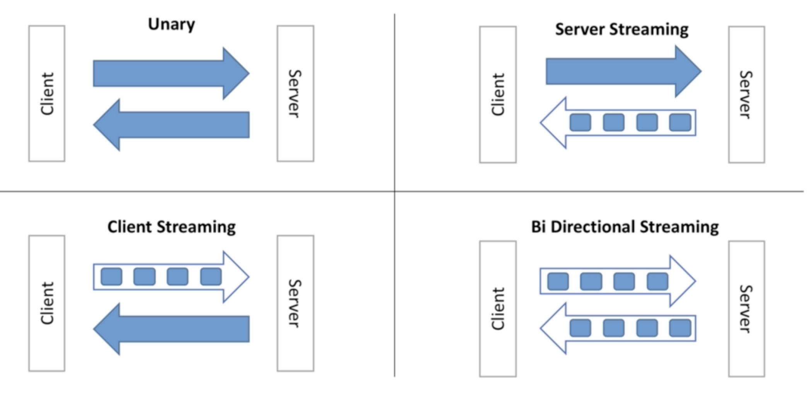
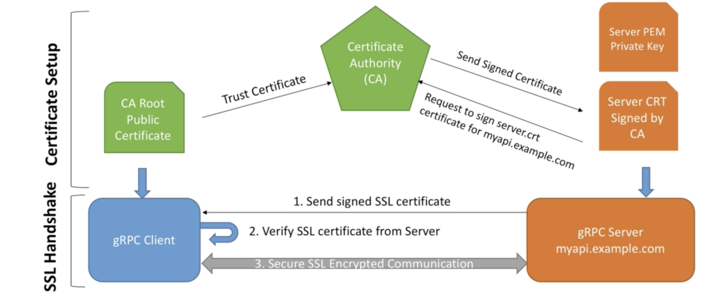
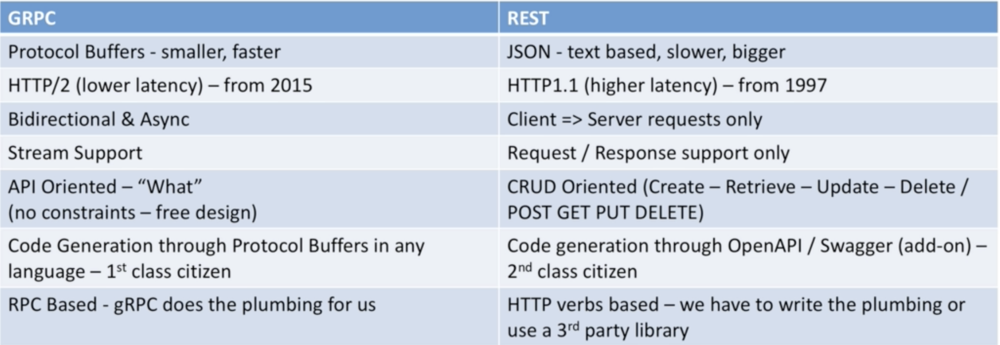

# gRPC-microservices
building API and Microservices using google gRPC and golang


## Protocol buffer over JSON

1. **Small payload size** - Payload size of same data with protbuf is much much smaller than json.
2. **Faster to parse** - JSON is human readable, so serialising / deserialising json is cpu intensive whereas serialising / deserialising protocol buffer is less CPU because data format is binary which is much closer to what machine understands. Faster to parse by CPU, faster to transmit over network.


## HTTP 2.0

#### HTTP/1.1 drawbacks
* Opens a new TCP connection to server at each request.
* No header compression, sent as plaintext (headers contains much more data than actual request).
* It only works with request / response mechanism (no server push).
* HTTP/1.1 is text based protocol.

####  HTTP/2 advantage
* Supports multiplexing
  * the server and client can push messages in parallel over the **_same_** TCP connection.
* Server push - **less chatty protocol**
  * server can push stream (multiple messages) to the clients
* header compression -  **reduced latency**
* is binary  - **faster over network**
  * HTTP/2 is binary and efficient over network, for the same reason protocol buffer is great match with HTTP/2

[HTTP/2 vs HTTP/1.1 performance](https://imagekit.io/demo/http2-vs-http1)

## gRPC

### Types of gRPC API

1. **Unary** - simple request response API over single TCP connection - just like traditional REST APIs.
2. **Server streaming** - server pushes multiple response to clients over single TCP connection.
3. **Client streaming** - client pushes multiple request to server over single TCP connection.
4. **Bidirectional streaming** - both client and server exchange multiple request and responses over single TCP connection.
    * The two streams operate independently, so clients and servers can read and write in whatever order they like.
    * The order of messages in each stream is preserved.



#### gRPC service definition in protobuf

```protobuf
service GreetService {
  // unary
  rpc Greet(GreetRespquest) returns (GreetResponse) {};

  // server side streaming
  rpc GreetManyTimes(GreetRespquest) returns (stream GreetResponse) {};

  // client side streaming
  rpc LongGreet(stream GreetRespquest) returns (GreetResponse) {};

  // bidirectional streaming
  rpc GreetEveryone(stream GreetRespquest) returns (stream GreetResponse) {};
}
```

### gRPC scalability
1. _gRPC servers are asynchronous by default._ This means gRPC doesn't block threads on request and can handle many many requests in parallel.
2. gRPC clients can perform client side load balancing.

### gRPC security
1. By default, gRPC strongly recommends for you to use SSL (encryption over wire).
2. Using interceptors, authentication can also be provided.




### gRPC vs REST




### gRPC Deadlines
Deadaline allows gRPC clients to specify how long they are willing to wait for an RPC to complete before the RPC is terminated with the error `DEADLINE_EXCEEDED`.

It is recommended to set deadline for all gRPC calls.

1. server should check if deadline has exceeded and cancel the work it is doing.
2. deadlines are propagated across if gRPC are calls are chained.
    * A => B => C, deadline for A is passed to B and then passed to C


### References

[pubsub.proto](https://github.com/googleapis/googleapis/blob/master/google/pubsub/v1/pubsub.proto)

### gRPC CLI

https://github.com/ktr0731/evans#macos

```bash
evans -p 50051 -r
```

```bash
greet.GreetService@127.0.0.1:50051> call Greet
greeting::first_name (TYPE_STRING) => Himannshu
greeting::last_name (TYPE_STRING) => Sahu
{
  "result": "Hello Himannshu Sahu"
}
```
